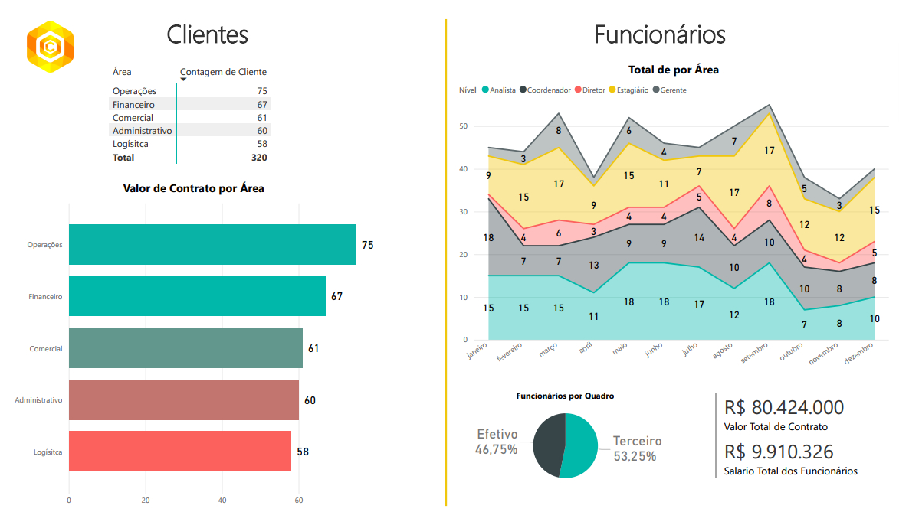

# Projeto: Dashboard de Análise de Gestão de Recursos Humanos e Performance de Contratos

### ➡️ Análise Detalhada e Dashboard Interativo no Meu Portfólio:
[Acesse a página completa do projeto aqui](https://ferreiragabrielw.github.io/portfolio-gabriel/projetos/Dashboards/1DashboardFuncionarios/Projeto1DA.html)

---

## Sobre o Projeto

Este projeto consiste em um dashboard analítico desenvolvido em **Power BI** para oferecer uma visão sobre a força de trabalho e a performance de contratos de uma organização. O foco é identificar e gerenciar contratos de alto valor e sua criticidade, apoiando decisões estratégicas em RH e otimização de operações.

## Tecnologias e Processo

* **Ferramentas**: Power BI Desktop, Microsoft Excel (fontes de dados).
* **ETL**: Dados extraídos de bases Excel, transformados no Power Query (M) e modelados para análise.
* **Insights Chave**: Identificação de predominância de terceirizados, concentração de valor em contratos críticos e diferenciação de clientes estratégicos.

## Conteúdo do Repositório

* `data/`: Bases de dados Excel utilizadas.
* `powerbi/`: Arquivo `.pbix` do dashboard Power BI.
* `README.md`: Este documento.
* `LICENSE`: Licença do projeto (MIT License).

## Como Visualizar

* **Online**: [Acesse o dashboard publicado no Power BI Service]([LINK_PARA_SEU_DASHBOARD_PUBLICADO_NO_POWER_BI_SERVICE](https://app.powerbi.com/signin#code=1.AcoAsvz-9yT-7EifbLQOC4fXDA8BHIdhXrFPg6yYYQp-kRABAADKAA.AgABBAIAAABVrSpeuWamRam2jAF1XRQEAwDs_wUA9P-MQSWaCGaU_uwLSKjj-kcDXeqcV2uINpo_48vGdlCmLpZ4ZZ58qwlUAfJCR_M1uxTrJr-fukjkl9zAZDD-SPgPnTeZy8MnxRDhnHlskQl0X6lPtZbXvUqy-TSJ4FPrWV9DpFf85q_gKcb1NeF2ifCagJbOYAbIMmqni5stg9gmwZK8U6bYq5-DFC5uVjDABOcmZ5crccyasuM-tlpZ_9zd9T0DhMvV4VsVbWaZSynWrNVxBRf-6W-YiRLFZsu7P1kLzw8K1_AgetuuAa4fSiurF_jhGnakT8XN6MO3kghnil7Nau_iJpKGYn1twFi5mEfrROmyak3qr3SQccbDM-CRpWzCd9_gUDs9Q2vbmL8SyQmp3VnZgouaOBET704_yqQLaQedk82bRiXdWpylL86hfn5YwUnywULlt2td_p5zBgrre3DFu_sUieNAnYDShHElzRy87aTEmuKwGRAoFJDCJ7YWOnwjnblm-Y4PJaDyphb66RtCehnOlSO1eJ-7nG2OYYsgjLWMC6HbsCsod2IMPCCHfYwb0zyZ6mnI5ifm7kYh_GfaK0P-lWHceLHbzBRgbTbC6Sl_g1lHSAXePj3I_gKNj74KZJlWHnz0mw8rR8jp-dO7GJuTqCTxvOSEaDJx1tNHQP-UXVh5YPl40IKn7xaHmbEH-oPjD0Z2yRoGrzHPgeUrefohBzgTVrfClXMmaiPd-I_6sIA958aikRLg75uig-2MI1CmxiLsDmLw7vvuVXj5mRbyQf8sJ8srkwTOTtoO4fy7AGAjsd9eQbqmayhkPF1UfcVFxiFirhh8wWeUVoYCKmFngUzYZKQAlWendM-Nm3H5DbW088ywgAWCHQeMZToTgaEpnDwdi2OCqO1qUVx22i4v7szvv70AiWBUg9Vrttes7HUJa25U4yBPEuEIIIR52iBlPGaBOA&client_info=eyJ1aWQiOiJmOWNmZmYzYi1hYWJkLTQ3OTEtYTIyMy0xOTNhNzAzOWY2MGEiLCJ1dGlkIjoiZjdmZWZjYjItZmUyNC00OGVjLTlmNmMtYjQwZTBiODdkNzBjIn0&state=eyJpZCI6IjAxOTc3ZmMxLTZmMTYtN2Q3NS05NzRjLTIwNzE4ODgwNmIwMiIsIm1ldGEiOnsiaW50ZXJhY3Rpb25UeXBlIjoicmVkaXJlY3QifX0%3d%7c1750195072783%3b1750195072786.4001%3b1750195071395.1&session_state=005ca6d9-a8a7-e568-3977-74783cef90a5&correlation_id=01977fc1-6f13-7b6b-9bf1-6d8a533f8a3c))
* **Localmente**: Faça o download do arquivo `.pbix` na pasta `powerbi/` e abra-o com o Power BI Desktop.

---

### Licença

Este projeto está licenciado sob a [MIT License](LICENSE).
